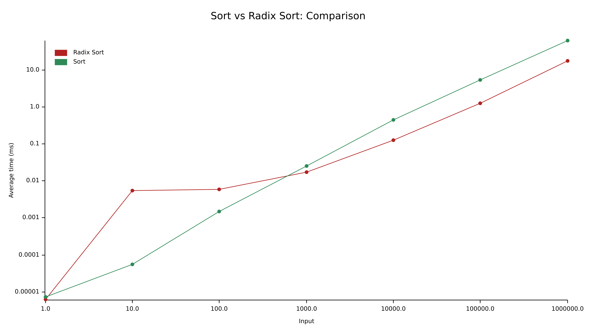

# rust-radix-sort

---

A simple radix sort algorithm for 32-bit signed integers.
- `cargo test` for tests
- `cargo bench` for benchmarks

---

### Performance Comparison

The performance of this radix sort implementation compared to Rust's std::vec::Vec::sort.
The graph has logarithmic axes for better visualization. "Input" refers to the size of
the given vector.

---

\
Erika Marttinen 2021

